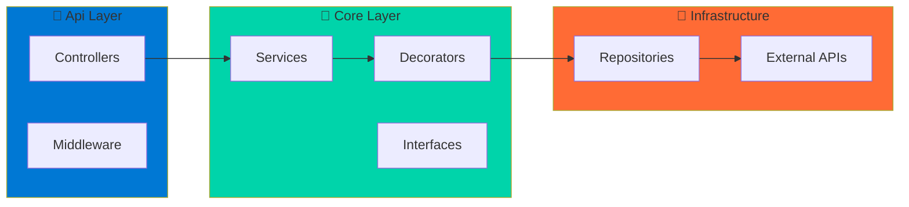
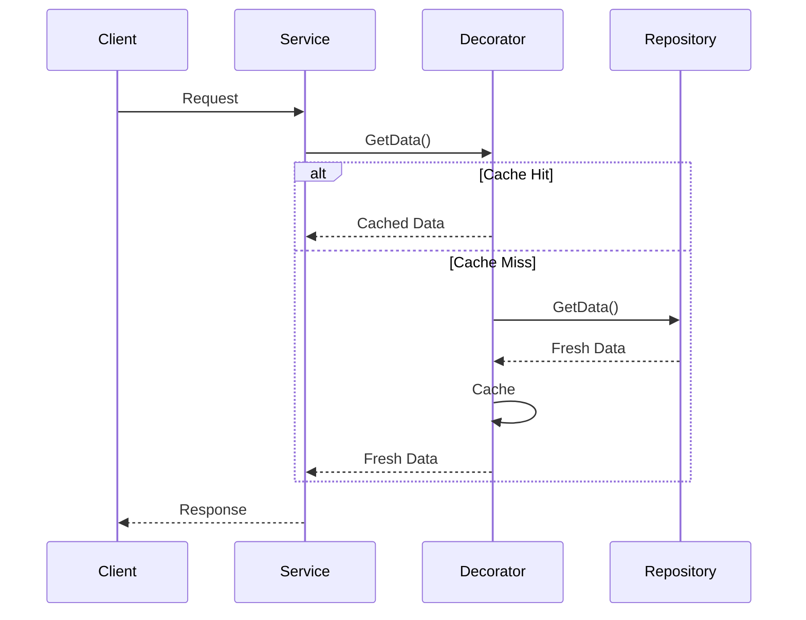

# 🌤️ Weather API

A **production-grade** .NET 8 weather API service deployed on AWS Lightsail, built with **Clean Architecture** principles and the **Decorator Pattern** for separation of concerns. Provides geocoding and current weather data with intelligent caching, rate limiting, and comprehensive test coverage.

## 🏗️ Architecture

### Clean Architecture Layers



### Request Flow (Decorator Pattern)



## ✨ Features

- **🌍 Geocoding**: Convert city/state or postal codes to coordinates
- **🔄 Reverse Geocoding**: Get location details from coordinates
- **☀️ Current Weather**: Real-time weather data for any location
- **⚡ Smart Caching**: 10-minute cache TTL for optimal performance
- **🛡️ Rate Limiting**: 60 requests per minute per IP
- **❤️ Health Monitoring**: Built-in health check endpoint

## 🛠️ Tech Stack

| Layer | Technology |
|-------|-----------|
| **Framework** | .NET 8 (ASP.NET Core Web API) |
| **Architecture** | Clean Architecture + Repository Pattern |
| **Design Pattern** | Decorator Pattern (Caching) |
| **Validation** | FluentValidation |
| **External API** | OpenWeather API (via Refit) |
| **Caching** | In-Memory Cache (IMemoryCache) |
| **Infrastructure** | AWS Lightsail + ECR |
| **IaC** | Terraform |
| **Containerization** | Docker |
| **Testing** | xUnit + AutoFixture + Moq |

## 📁 Project Structure

```
Weather.Api/
├── src/
│   ├── Api/                          # 🎨 Presentation Layer
│   │   ├── Controllers/              # REST API endpoints
│   │   ├── Middleware/               # Exception handling, API keys, rate limiting
│   │   ├── Validators/               # FluentValidation rules
│   │   └── Startup/                  # DI configuration
│   │
│   ├── Core/                         # 💼 Application & Domain Layer
│   │   ├── ApplicationLogic/         # Business services (WeatherService, GeocodeService)
│   │   ├── Decorators/               # Caching decorators (Decorator Pattern)
│   │   ├── Interfaces/               # Repository & service abstractions
│   │   ├── Models/                   # Domain models (Geocode, Weather, etc.)
│   │   ├── DTOs/                     # OpenWeather API contracts
│   │   ├── RequestModels/            # API request models
│   │   └── ResponseModels/           # API response models
│   │
│   └── Infrastructure/               # 🔧 Infrastructure Layer
│       ├── Repositories/             # Repository implementations (clean data access)
│       ├── ExternalServices/         # OpenWeather API client
│       └── Interfaces/               # External API interfaces (Refit)
│
├── tests/
│   ├── UnitTests/                    # Unit tests (Services, Controllers, Repositories)
│   │   ├── Services/                 # Service layer tests
│   │   ├── Controllers/              # Controller tests
│   │   └── Repositories/             # Repository & decorator tests
│   ├── ServiceTests/                 # Integration tests
│   └── Wiremock/                     # Mock server for testing
│
└── terraform/                        # Infrastructure as Code (AWS Lightsail)
```

### Architecture Highlights

✅ **Clean Architecture** - Clear separation of concerns across layers  
✅ **Repository Pattern** - Abstraction over data access  
✅ **Decorator Pattern** - Caching as a cross-cutting concern  
✅ **Dependency Injection** - Loose coupling and testability  
✅ **SOLID Principles** - Single Responsibility, Open/Closed, Interface Segregation, etc.

## 🚀 Getting Started

### Prerequisites

- .NET 8 SDK
- Docker (for deployment)
- OpenWeather API key
- AWS CLI (for deployment)

### Local Development

1. **Clone the repository**
   ```bash
   git clone <repository-url>
   cd Weather.Api
   ```

2. **Configure settings**
   ```bash
   # Update appsettings.Development.json with your API key
   {
     "OpenWeatherApiKey": "your-key-here"
   }
   ```

3. **Run the API**
   ```bash
   dotnet run --project src/Api/Api.csproj
   ```

4. **Access the API**
   ```
   http://localhost:5000/health
   ```

## 📡 API Endpoints

| Endpoint | Method | Description | Parameters |
|----------|--------|-------------|------------|
| `/health` | GET | Health check | None |
| `/geocode/city` | GET | Geocode by city/state | `city`, `state`, `countrycode` |
| `/geocode/postalcode` | GET | Geocode by postal code | `postalcode`, `countrycode` |
| `/reversegeocode` | GET | Reverse geocode | `lat`, `lon` |
| `/weather` | GET | Current weather | `lat`, `lon` |

### Example Request

```bash
# Get weather for a location
curl "https://weather-api.mattlittle.me/weather?lat=40.7128&lon=-74.0060"
```

### Example Response

```json
{
  "lat": 40.7128,
  "lon": -74.006,
  "timezone": "America/New_York",
  "current": {
    "dt": 1696435200,
    "temp": 72.5,
    "feels_like": 70.2,
    "humidity": 65,
    "weather": [
      {
        "main": "Clear",
        "description": "clear sky"
      }
    ]
  }
}
```

## 🐳 Deployment

The API uses an automated deployment pipeline with Docker and AWS Lightsail:

```mermaid
flowchart TD
    A[Local Development] -->|docker build| B[Docker Image]
    B -->|docker tag| C[ECR Tagged Image]
    C -->|docker push| D[AWS ECR Registry]
    D -->|pull| E[AWS Lightsail Container]
    E --> F[Live API]
    
    style A fill:#2d3748
    style D fill:#ff9900
    style F fill:#00d4aa
```



### Deploy Command

```bash
./dockerdeploy.sh
```

The script will:
1. Build and tag the Docker image
2. Push to AWS ECR
3. Trigger Lightsail deployment
4. Monitor deployment status until completion
5. Display service URL on success

## 🧪 Testing

Comprehensive test coverage with **unit tests** for all layers following the **AAA pattern** (Arrange, Act, Assert).

```bash
# Run all tests
dotnet test

# Run specific test project
dotnet test tests/UnitTests/UnitTests.csproj

# Run with coverage
dotnet test --collect:"XPlat Code Coverage"
```

### Test Structure

```
tests/
├── UnitTests/
│   ├── Services/              # Business logic tests
│   │   ├── WeatherServiceTests.cs
│   │   └── GeocodeServiceTests.cs
│   ├── Controllers/           # API endpoint tests
│   │   ├── WeatherControllerTests.cs
│   │   └── GeocodeControllerTests.cs
│   └── Repositories/          # Repository layer tests
│       ├── WeatherRepositoryTests.cs
│       ├── GeocodeRepositoryTests.cs
│       ├── CachedWeatherRepositoryTests.cs
│       └── CachedGeocodeRepositoryTests.cs
├── ServiceTests/              # Integration tests
└── Wiremock/                  # Mock API server
```

### Test Coverage

- ✅ **Services** - Pure business logic, dependency injection validation
- ✅ **Controllers** - Request validation, error handling, response mapping
- ✅ **Repositories** - Data access, API integration, error propagation
- ✅ **Decorators** - Cache hit/miss scenarios, cache storage, exception handling
- ✅ **Testing Tools** - xUnit + AutoFixture + Moq + FluentAssertions

## 🔍 Health Monitoring

The API includes a health check endpoint for monitoring:

```bash
GET /health
```

**Response:**
```json
{
  "status": "Healthy"
}
```

## 📄 License

This project is licensed under the MIT License.

---

**Built with ❤️ using .NET 8, Clean Architecture, and AWS Lightsail**
