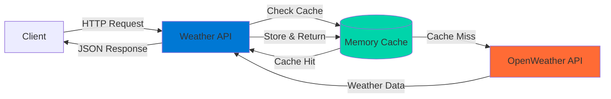
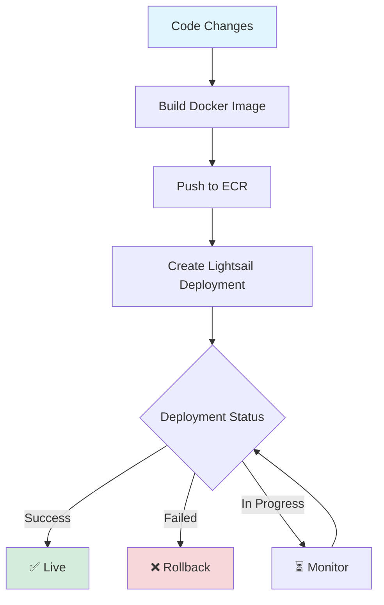

# 🌤️ Weather API

A high-performance .NET 9 weather API service deployed on AWS Lightsail, providing geocoding and current weather data with intelligent caching and rate limiting.

## 🏗️ Architecture



## ✨ Features

- **🌍 Geocoding**: Convert city/state or postal codes to coordinates
- **🔄 Reverse Geocoding**: Get location details from coordinates
- **☀️ Current Weather**: Real-time weather data for any location
- **⚡ Smart Caching**: 10-minute cache TTL for optimal performance
- **🛡️ Rate Limiting**: 60 requests per minute per IP
- **❤️ Health Monitoring**: Built-in health check endpoint

## 🛠️ Tech Stack

| Layer | Technology |
|-------|-----------|
| **Framework** | .NET 9 (Minimal APIs) |
| **Validation** | FluentValidation |
| **External API** | OpenWeather API |
| **Caching** | In-Memory Cache |
| **Infrastructure** | AWS Lightsail + ECR |
| **IaC** | Terraform |
| **Containerization** | Docker |
| **Testing** | xUnit + AutoFixture + Moq |

## 📁 Project Structure

```
Weather.Api/
├── src/
│   ├── Api/                    # API layer (controllers, middleware)
│   │   ├── ApplicationLogic/   # Business logic & services
│   │   ├── Controllers/        # API endpoints
│   │   └── Validators/         # Request validation
│   └── Core/                   # Domain models & DTOs
│       ├── DTOs/              # OpenWeather API contracts
│       └── Models/            # Domain models
├── terraform/                  # Infrastructure as Code
└── UnitTests/                 # Comprehensive test coverage
```

## 🚀 Getting Started

### Prerequisites

- .NET 9 SDK
- Docker (for deployment)
- OpenWeather API key
- AWS CLI (for deployment)

### Local Development

1. **Clone the repository**
   ```bash
   git clone <repository-url>
   cd Weather.Api
   ```

2. **Configure settings**
   ```bash
   # Update appsettings.Development.json with your API key
   {
     "OpenWeatherApiKey": "your-key-here"
   }
   ```

3. **Run the API**
   ```bash
   dotnet run --project src/Api/Api.csproj
   ```

4. **Access the API**
   ```
   http://localhost:5000/health
   ```

## 📡 API Endpoints

| Endpoint | Method | Description | Parameters |
|----------|--------|-------------|------------|
| `/health` | GET | Health check | None |
| `/geocode/city` | GET | Geocode by city/state | `city`, `state`, `countrycode` |
| `/geocode/postalcode` | GET | Geocode by postal code | `postalcode`, `countrycode` |
| `/reversegeocode` | GET | Reverse geocode | `lat`, `lon` |
| `/weather` | GET | Current weather | `lat`, `lon` |

### Example Request

```bash
# Get weather for a location
curl "https://weather-api.mattlittle.me/weather?lat=40.7128&lon=-74.0060"
```

### Example Response

```json
{
  "lat": 40.7128,
  "lon": -74.006,
  "timezone": "America/New_York",
  "current": {
    "dt": 1696435200,
    "temp": 72.5,
    "feels_like": 70.2,
    "humidity": 65,
    "weather": [
      {
        "main": "Clear",
        "description": "clear sky"
      }
    ]
  }
}
```

## 🐳 Deployment

The API uses an automated deployment pipeline with Docker and AWS Lightsail:



### Deploy Command

```bash
./dockerdeploy.sh
```

The script will:
1. Build and tag the Docker image
2. Push to AWS ECR
3. Trigger Lightsail deployment
4. Monitor deployment status until completion
5. Display service URL on success

## 🧪 Testing

Comprehensive unit test coverage with 19 tests across controllers and service layer.

```bash
# Run all tests
dotnet test

# Run with coverage
dotnet test --collect:"XPlat Code Coverage"
```

### Test Coverage

- ✅ **Controllers**: Validation, error handling, success scenarios
- ✅ **Services**: Caching behavior, API integration, error cases
- ✅ **Health Checks**: Endpoint availability

## 🔍 Health Monitoring

The API includes a health check endpoint for monitoring:

```bash
GET /health
```

**Response:**
```json
{
  "status": "Healthy"
}
```

## 📄 License

This project is licensed under the MIT License.

---

**Built with ❤️ using .NET 9 and AWS Lightsail**
